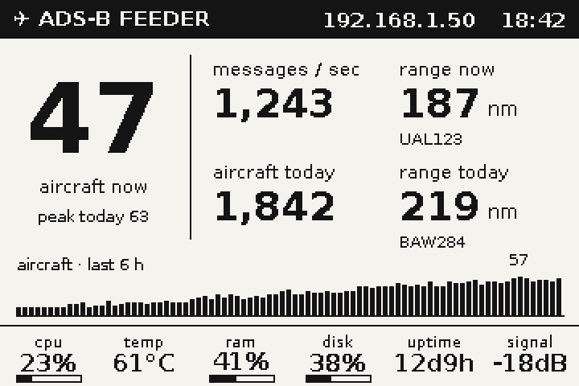
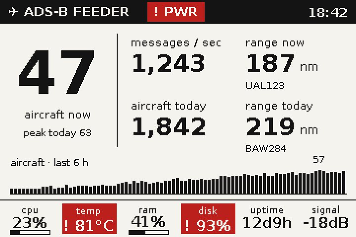
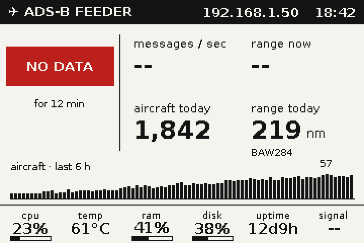

# adsb-feeder-epaper

Status display for a Raspberry Pi ADS-B feeder on a **Waveshare 3.52" e-Paper (B)**
panel (360 x 240, black / white / red), designed for an outdoor enclosure with a
transparent cover.



<details><summary>Alert and no-data states</summary>



</details>

## What it shows

| Zone | Content |
|------|---------|
| Header | hostname-free title, feeder IP, time of last panel refresh |
| Hero | aircraft currently tracked (with position), today's concurrent peak |
| Tiles | messages/sec, farthest aircraft right now (callsign), unique aircraft today, farthest today |
| Sparkline | aircraft count over the last 6 h (peak labelled) |
| Footer | CPU %, SoC temp, RAM %, disk %, uptime, mean RF signal (dBFS) |

**Red means look at me.** A healthy feeder renders pure black-and-white; red ink is
reserved for alerts: data source down (`NO DATA`), high SoC temperature, RAM/disk
nearly full, and undervoltage/throttling chips in the header. Alerts also trigger an
early panel refresh (never more often than the 3-minute minimum the panel tolerates).

The screen does a full refresh every 5 minutes by default — tri-colour e-paper has no
partial refresh, and Waveshare recommends >= 3 minutes between refreshes. Data is
polled every 30 s regardless, so daily aggregates (unique aircraft, range records,
peak) and the sparkline stay accurate. State survives restarts via
`/var/lib/adsb-epaper/state.json`.

## Data sources

Reads readsb/tar1090 JSON from the adsb.im feeder image (auto-detects
`http://127.0.0.1/tar1090/data` or `:8080/data`):

- `aircraft.json` — tracked aircraft, positions, callsigns
- `stats.json` — message rate and signal level (optional; falls back to counter deltas)
- `receiver.json` — receiver location for range computation (or set `lat`/`lon` in config)

## Install (on the Pi)

```sh
sudo ./install.sh
```

Enables SPI, installs `python3-pil python3-spidev python3-gpiozero python3-lgpio`,
copies the code to `/opt/adsb-epaper`, and enables the `adsb-epaper` systemd service.
If SPI was previously disabled, reboot once after installing.

Config lives at `/etc/adsb-epaper/config.toml` (see `config.example.toml` for all
keys — units nm/km/mi, refresh cadence, alert thresholds, `rotate_180` for
upside-down mounting).

```sh
journalctl -u adsb-epaper -f        # logs
sudo systemctl restart adsb-epaper  # apply config changes
```

## Web UI

`http://<feeder-ip>:8099/` mirrors exactly what the panel is showing — the same
frame that was last pushed to the e-paper, plus how long ago it refreshed. Served
by the service itself (stdlib only); disable or move it in the `[webui]` config
section.

## Development preview (any machine)

```sh
python preview.py   # renders out/preview_{healthy,alerts,nodata}.png
```

The display driver falls back to PNG output automatically when the panel/SPI stack
is absent, so `python -m adsb_epaper.main --once` works off-Pi too.

## Layout

- `adsb_epaper/` — service package (config, collectors, renderer, display, main loop)
- `lib/waveshare_epd/` — vendored Waveshare driver for the 3.52" (B) panel
- `assets/fonts/` — vendored DejaVu fonts (identical rendering on dev machine and Pi)
